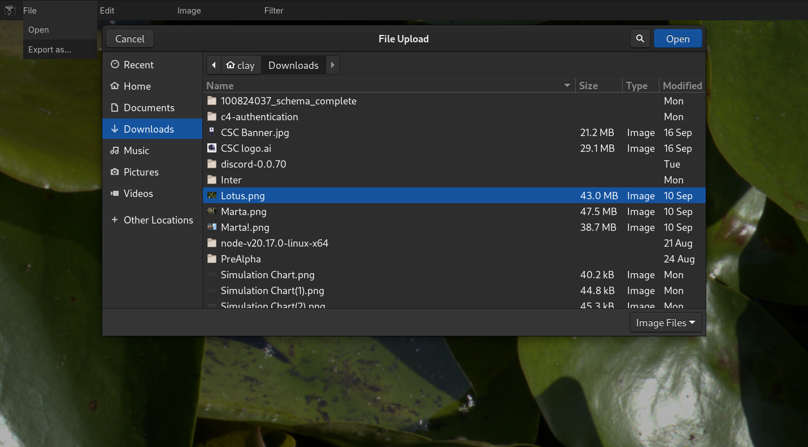
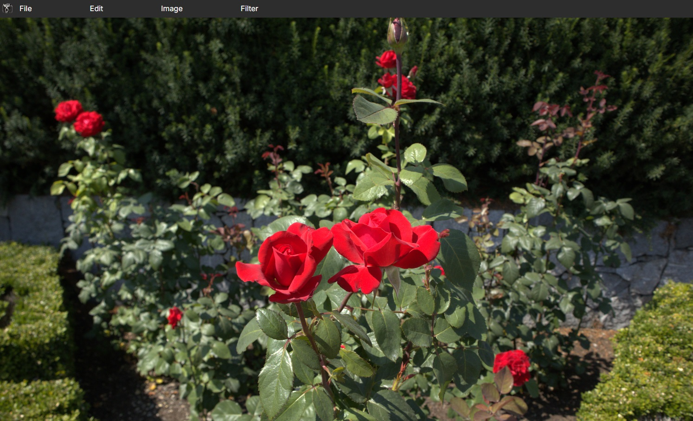
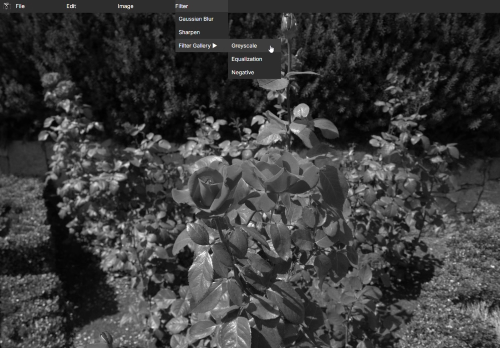
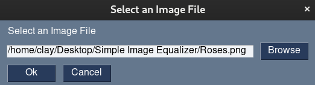
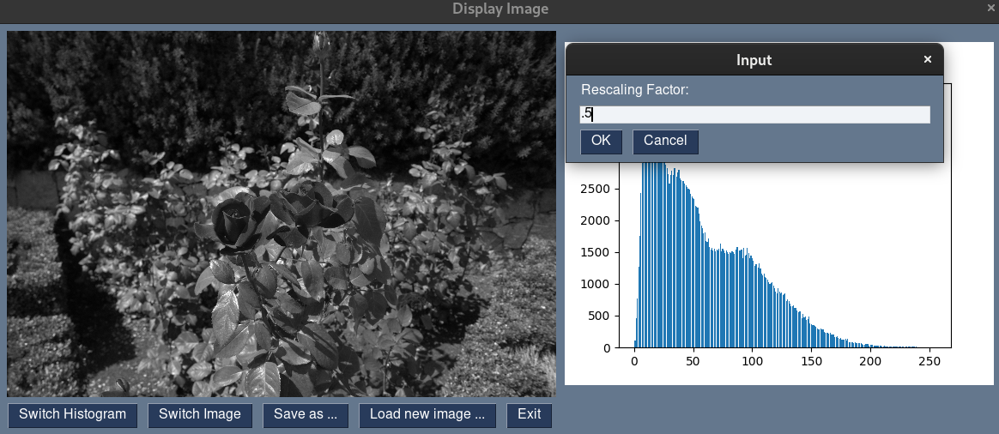
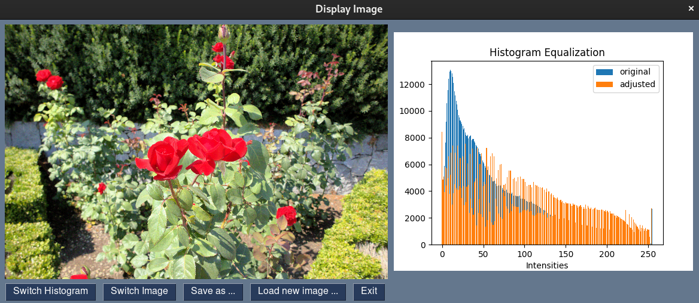
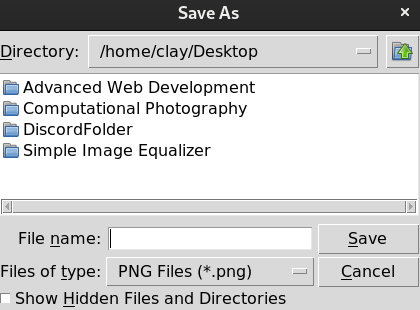

# WebappPhotoedits
Photo manipulation software using JavaScript inspired by applications like Photoshop and Photopea.
Provding filter and image transformations.

# Current Stage
A JavaScript Webapp that serves a photo manipulation user interface to a front-end user using Node.js and Express.js. This code also contains functionality to be used apart from a front end to allow programatic interactions by creating on the fly canvas elements for image instantiation.

Currently in development.

### Installation
1. Install packages:
   ```bash
   npm i
   ```
2. Run local server:
   ```bash
   node server.js
   ```

### Images
Image imports working with front end users local storage.


Front end visualization of image.


Taskbar interaction that manipulates the image mapped to the canvas.



# Prototype
A Python application that allows users to convert images to greyscale and equalizations.

- Loads images in JPG, JPEG, PNG, BMP.
- Display original and processed images alongside their histograms.
- Scale and export images.

## Requirements

To run this application, you'll need Python and the following packages:

- PySimpleGUI
- Pillow
- numpy
- opencv-python
- matplotlib
- Tkinter

### Installation

1. Clone the repository:
   ```bash
   git clone https://github.com/yourusername/image-grayscale-equalization.git
   cd image-grayscale-equalization
   ```

2. Install the required packages:
   ```bash
    pip install -r ./Prototype/requirements.txt
   ```

3. (Optional) Make sure Tkinter is installed:
   - **Ubuntu**:
      ```bash
      sudo apt-get install python3-tk
      ```
   - **AlmaLinux**:
      ```bash
      sudo dnf install python3 python3-pip python3-tkinter
      ```

## Usage

1. Run the application in terminal (WebappPhotoedits/Prototype/):
   ```bash
   python sIE.py
   ```
   To pass with an image attached:
   ```bash
   python sIE.py image_name.extension
   ```

2. Use the **Load Image** button to select an image file.

3. Program includes the following functionalities:
   - **Switch Image**: Toggle between the original and grayscale images.
   
   - **Switch Histogram**: Toggle between the original and adjusted histograms.
   
   - **Save as ...**: Adjust the scale of and save the original image based on displayed modifications.
   

## Acknowledgments

- [Faisal Z. Qureshi](http://vclab.science.uoit.ca/)
[^](https://csundergrad.science.uoit.ca/courses/csci3240u/labs/lab2-image-enhancement/image_viewer.py)
